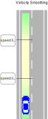
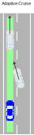
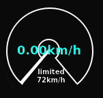
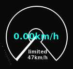
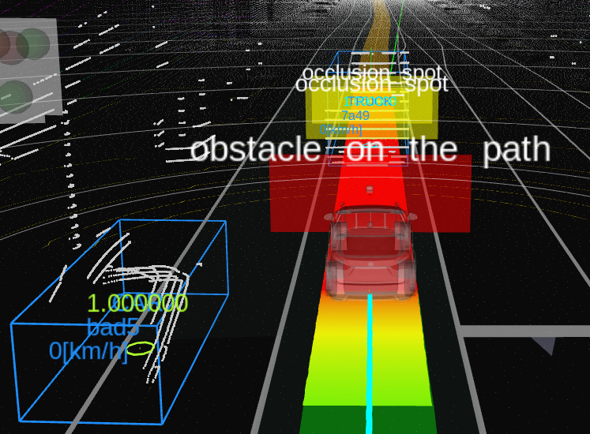
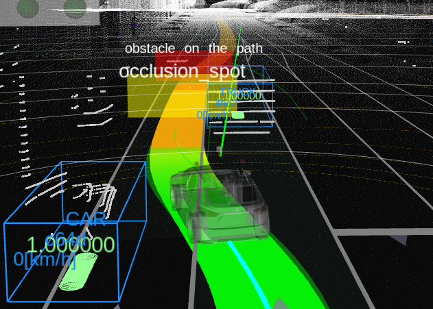
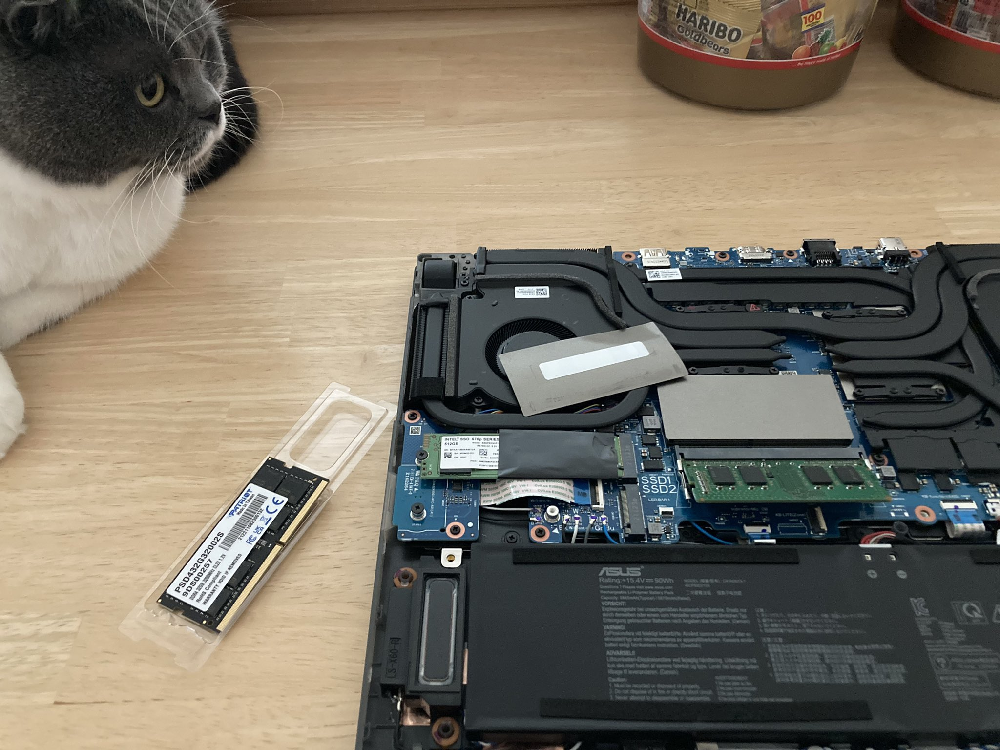
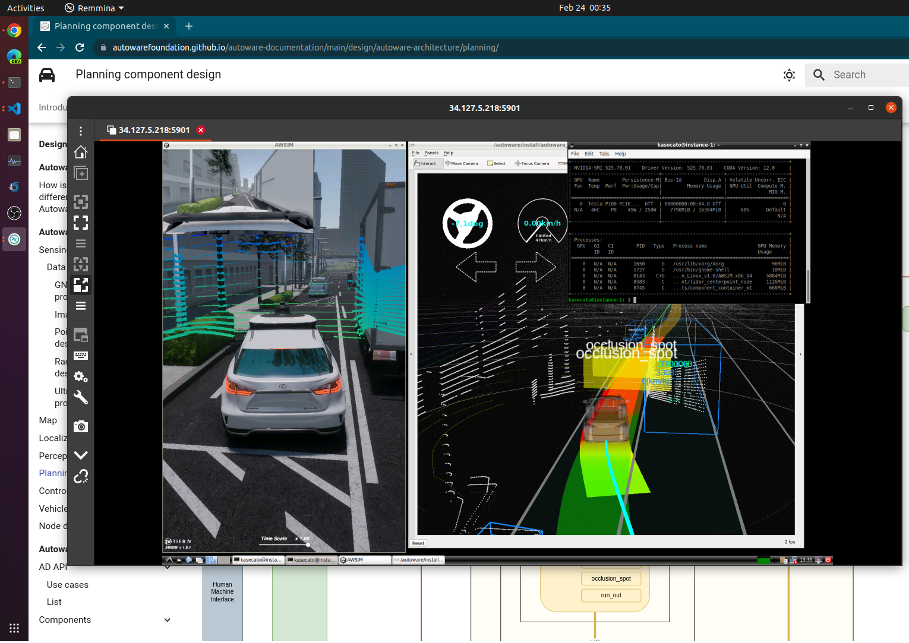

# Japan Automotive AI Challenge
## 2022 (Simulation) Competition
## Advanced Course - 3rd Place - YutakaJCT


### [Japan Automotive AI Challenge - Awards Ceremony](https://www.jsae.or.jp/jaaic/en/summary.php)
### @[Tokyo Culture Culture](https://tokyocultureculture.com/)

March 6, 2023


# About YutakaJCT

|                 |                                                   |
| --------------- | ------------------------------------------------- |
| Member          | (1) Keisuke Kato / 加藤 圭佑                      |
| Company         | LINE Fukuoka                                      |
| Work Experience | Server-side Engineer, Wallet                      |
| Education       | CS degree                                         |
| From            | Fukuoka                                           |
| Team Name       | Yutaka JCT / 豊JCT that don't curve well with ACC |
| My Car          | Peugeot e-208 GT Line FWD, 50kWh, 260Nm, 100kW    |
| Love Car        | AE86 H2 Concept, Honda e, Model 2, ID.2           |
| Best Car        | MIRAI 2nd Gen.                                    |


# What We Did?

1. No Code
   * Velocity Smoothing
   * Avoidance
2. Off Topic
   * Buy Memory
   * Use GCP vGPU Instance


# (Our No Code) Architecture


Input = LiDAR + Map + IMU (No Camera)


# Lane Following in Planning

|                                                   |                                          |                                                |                                              |
| ------------------------------------------------- | ---------------------------------------- | ---------------------------------------------- | -------------------------------------------- |
|  |  |  |  |


## Velocity Smoothing

|                                                                 | As-Is                                                            | To-Be                                                            |
| --------------------------------------------------------------- | ---------------------------------------------------------------- | ---------------------------------------------------------------- |
|  |  |  |

| motion_velocity_smoother.param.yaml | As-Is    | To-Be       |
| ----------------------------------- | -------- | ----------- |
| max_velocity                        | 20.0 m/s | 12.9722 m/s |


## Avoidance

|                                                        | As-Is                                                        | To-Be                                                        |
| ------------------------------------------------------ | ------------------------------------------------------------ | ------------------------------------------------------------ |
|  |  |  |


## Avoidance - Center


| avoidance.param.yaml                   | As-Is | To-Be | Ideal  |
| -------------------------------------- | ----- | ----- | ------ |
| threshold_distance_object_is_on_center | 1.0 m | 0.0 m | Hazard |


## Avoidance - Debug

Echoing debug message to find out why the objects were ignored.

```bash
$ ros2 topic echo /planning/scenario_planning/lane_driving\
/behavior_planning/behavior_path_planner/debug/avoidance_debug_message_array
```

```bash
avoidance_info:
- object_id: e2cd8ce7a53efe3dbcfd545046c0e830
  allow_avoidance: false
  longitudinal_distance: 19.933871635857543
  lateral_distance_from_centerline: -0.021392588522659205
  to_furthest_linestring_distance: 2.8958805756534582
  max_shift_length: 1.4478805756534583
  required_jerk: 0.0
  maximum_jerk: 0.0
  failed_reason: InsufficientLateralMargin
```


## Avoidance - Collision Margin


| avoidance.param.yaml            | As-Is | To-Be | Ideal |
| ------------------------------- | ----- | ----- | ----- |
| lateral_collision_margin        | 1.0 m | 0.1 m | 0.5m  |
| lateral_collision_safety_buffer | 0.7 m | 0.1 m | 0.4m  |
| road_shoulder_safety_margin     | 0.5 m | 0.1 m | 0.25m |


## Off Topic - Buy Memory

|        | Required for 2022    | My Laptop                     |
| ------ | -------------------- | ----------------------------- |
| CPU    | Core i7 (8 cores)    | Ryzen 7 5800H (8 cores) (45W) |
| GPU    | RTX 3080 12GB (350W) | RTX 3080 8GB (150W)           |
| Memory | 32GB                 | 16GB (Crashes) -> 40GB        |




## Off Topic - Use GCP vGPU

|              |                       |
| ------------ | --------------------- |
| GCP Zone     | us-west1-a            |
| Machine type | n1-standard-16        |
| GPUs         | 1 x NVIDIA Tesla P100 |




# Thank you


# References

- aichallenge2022-sim, https://github.com/AutomotiveAIChallenge/aichallenge2022-sim/blob/main/README_en.md
- Architecture overview, https://autowarefoundation.github.io/autoware-documentation/main/design/autoware-architecture/
- Planning, https://autowarefoundation.github.io/autoware-documentation/main/design/autoware-architecture/planning/
- Motion Velocity Smoother, https://autowarefoundation.github.io/autoware.universe/main/planning/motion_velocity_smoother/
- Avoidance Module, https://autowarefoundation.github.io/autoware.universe/main/planning/behavior_path_planner/behavior_path_planner_avoidance-design/
- GCP NVIDIA P100 GPUs , https://cloud.google.com/compute/docs/gpus?hl=en#nvidia_p100_gpus
- PCoIP, https://cloud.google.com/architecture/creating-a-virtual-gpu-accelerated-linux-workstation?hl=en
- LINE Fukuoka Hackathon, https://engineering.linecorp.com/ja/blog/line-fukuoka-developers-remote-hackathon
