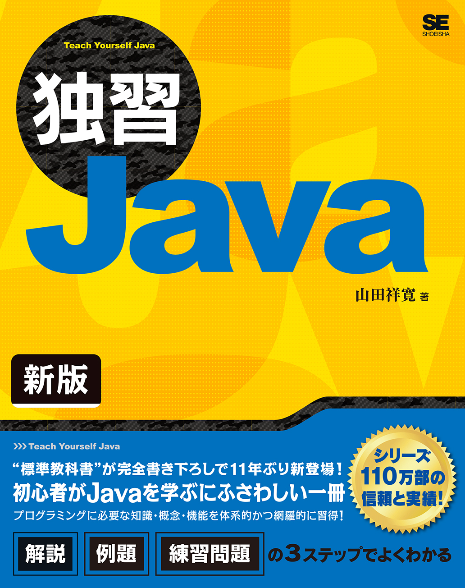
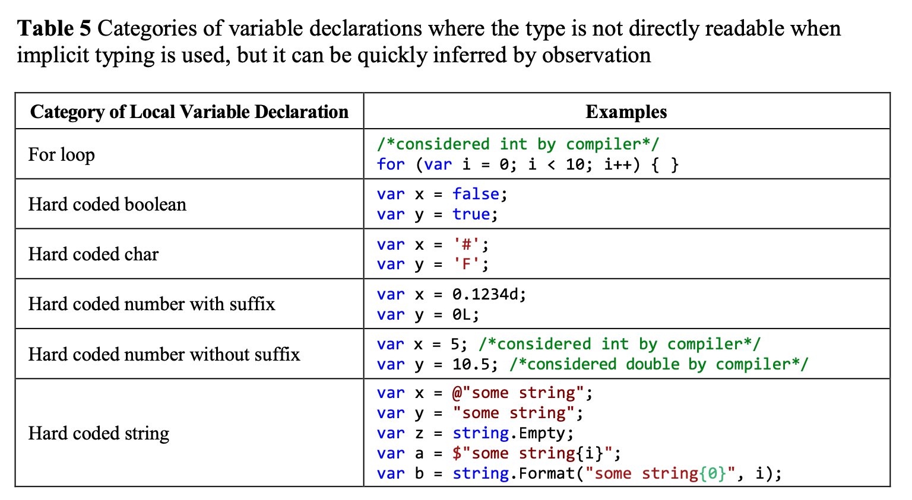
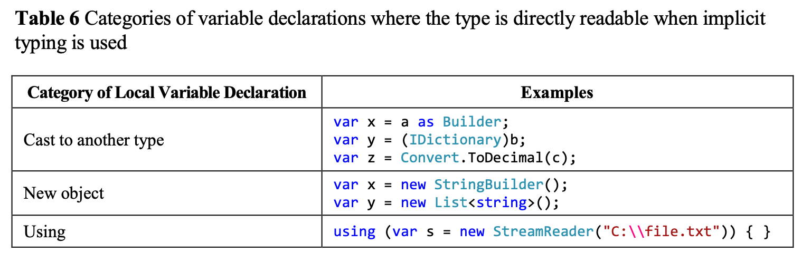
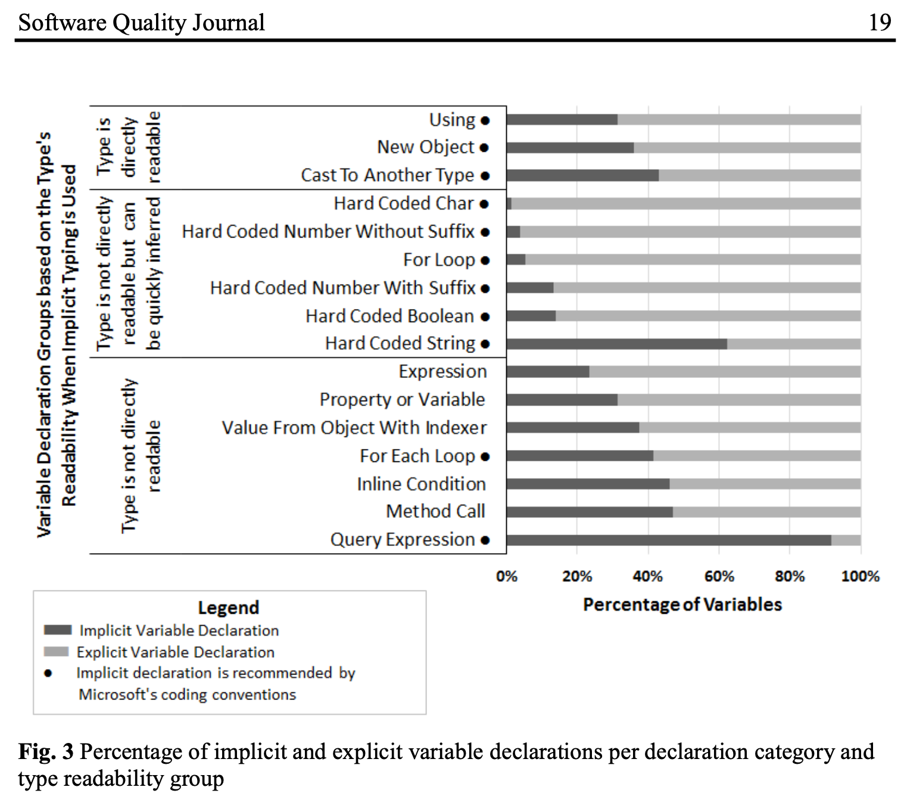
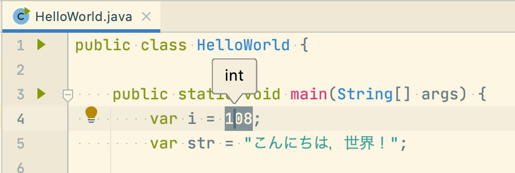
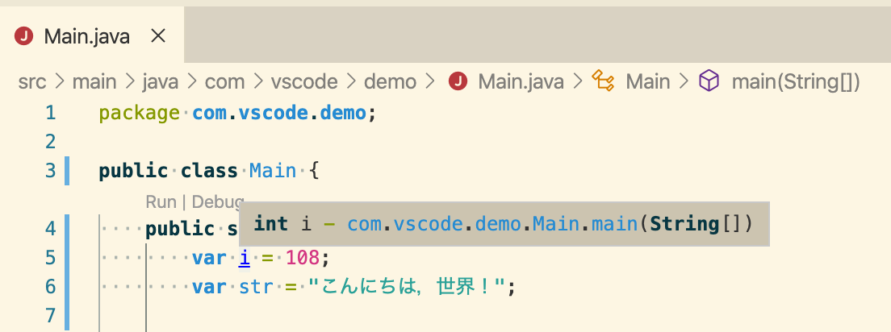
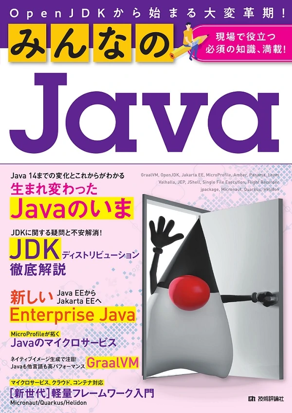
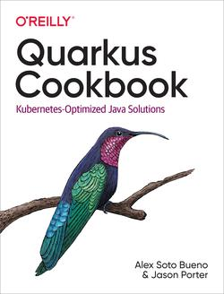
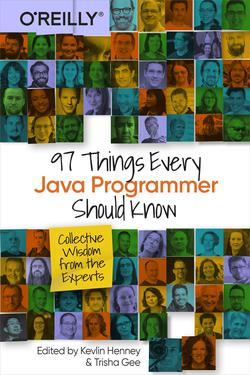
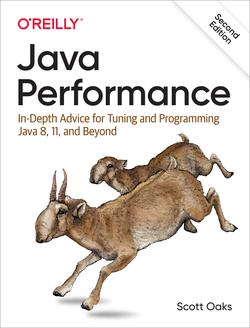

# 2020年に読んだ3つのJava本を振り返る

<a href="https://twitter.com/kasecato"></a>

## [Javaコミュ@福岡オンライン飲み会](https://javaq.connpass.com/event/188878/)
## @Zoom

2020/9/18 <a href="https://twitter.com/kasecato">@kasecato</a>


# About me

- LINE Fukuoka 2020年7月 入社
  - [サーバサイド エンジニア](https://linefukuoka.co.jp/ja/career/list/engineer/development_engineer_server-side)
  - GitHub [@kasecato](https://github.com/kasecato)
  - Twitter [@kasecato](https://twitter.com/kasecato)
- 初めて書いた Java
  - 2004 年に Java 4 か 5 を先生から教えてもらう
<!-- .element: class="fragment" data-fragment-index="1" -->
  - 通年 2 コマで 1 単位の自由参加プロジェクトでチャット サーバを作った
<!-- .element: class="fragment" data-fragment-index="2" -->
  - サーバを 1 ファイルに全部書いた，と思うw
<!-- .element: class="fragment" data-fragment-index="3" -->
  - 興味本位でサーバに SSL を組込み，アプリの起動が難しくなったｗ
<!-- .element: class="fragment" data-fragment-index="4" -->
  - https://www.nytimes.com/1994/08/12/business/attention-shoppers-internet-is-open.html
<!-- .element: class="fragment" data-fragment-index="4" -->
- 初めて読んだ Java 本
<!-- .element: class="fragment" data-fragment-index="5" -->
  - [『Java ネットワーク プログラミング 基礎からわかる 完全入門』](https://gihyo.jp/book/2004/4-7741-2168-1), 2004年 


# 独習Java 新版

<a href="https://www.shoeisha.co.jp/book/detail/9784798151120">
  
</a>

|           |           |
|-----------|-----------|
| 山田 祥寛 | 2019年5月 |

“標準教科書”が完全書き下ろしで11年ぶり新登場！
<!-- .element: class="fragment" data-fragment-index="1" -->


## 2.5.2 配列型

```java
var list = new int[] { 1, 2, 3, 4, 5 }
System.out.println(list.length);
```

> 配列は、newによってインスタンス化される一種のオブジェクトです（よって、lengthのようなフィールドにアクセスできるわけです）。ただし、文字列とStringのように、対応関係にあるクラスがあるわけではありません。あくまで言語仕様に組み込まれた、仮想的な（＝便宜的な）クラスです。（『独習Java 新版』）
<!-- .element: class="fragment" data-fragment-index="1" -->


## 3.1.4 除算とデータ型

```java
// Bad
System.out.println(5 / 0); // java.lang.ArithmeticException: / by zero
System.out.println(5 % 0); // java.lang.ArithmeticException: / by zero
System.out.println(5d / 0); // Infinity
System.out.println(5d % 0); // NaN
```

> 整数のゼロ除算はコンパイルエラーとなりますが、浮動小数点のゼロ除算はInfinity（無限大）、NaN（Not a Number：非数）という特殊な値になります。（『独習Java 新版』）
<!-- .element: class="fragment" data-fragment-index="1" -->

（nits: ランタイム エラー）
<!-- .element: class="fragment" data-fragment-index="2" -->


## 3.1.5 浮動小数点の演算には要注意

```java
// Bad
var bd1 = new BigDecimal(0.7);
```

```java
// Good
var bd1 = new BigDecimal("0.7");
```
<!-- .element: class="fragment" data-fragment-index="1" -->

> BigDecimalクラスをインスタンス化するときには、浮動小数点リテラルを利用してはいけません。リテラルの段階で誤差が発生してしまうからです。引数は文字列リテラルとして指定する、が原則です。（『独習Java 新版』）
<!-- .element: class="fragment" data-fragment-index="1" -->


## 4.2.3 for命令

```java
for (var i = 1; i < 6; i++) {
  Sysytem.out.println(i + "番目のループです。");
}
```

> カウンター変数には、慣例的にi、j、k…を利用します。この慣例は、古くはFORTRANの時代にまでさかのぼります。FORTRANでは「暗黙の型宣言」という仕組みがあり、i〜nではじまる変数は整数型と見なされるという規則がありました。（『独習Java 新版』）
<!-- .element: class="fragment" data-fragment-index="1" -->

（nits: Fortran を [FORTRAN](https://ja.wikipedia.org/wiki/FORTRAN) と書くと大文字「I〜N」）
<!-- .element: class="fragment" data-fragment-index="2" -->


## 5.2.1 文字列の長さを取得する

```java
// Bad
var str2 = "𠮟る";
System.out.println(str2.length()); // 結果：3
```

```java
// Good
var str2 = "𠮟る";
System.out.println(str2.codePointCount(0, str2.length())); // 結果：2
```
<!-- .element: class="fragment" data-fragment-index="1" -->

> Unicodeは1文字を2バイトとして表現します。しかし、Unicodeで扱うべき文字が増えるに従って、2バイトで表現できる文字数（65536文字）では不足する状況が出てきました。そこで一部の文字を4バイトで表現することで、扱える文字数を拡張することになりました。これがサロゲートペアです。（中略）サロゲートペアを含んだ文字列を正しくカウントするには、lengthメソッドの代わりに、codePointCountメソッドを利用してください。（『独習Java 新版』）
<!-- .element: class="fragment" data-fragment-index="1" -->


## 6.1.3 特殊なコレクションの生成

```java
// Bad
return new ArrayList();
return Arrays.asList();
```

```java
// Good
return Collections.emptyList();
```
<!-- .element: class="fragment" data-fragment-index="1" -->

> 空のコレクションを自前で作成しても意味的には一緒ですが、Collectionsクラスではあらかじめ用意された定数を返すので、無駄なオブジェクトを生成せずに済みます。（『独習Java 新版』）
<!-- .element: class="fragment" data-fragment-index="1" -->

Guava の [ImmutableList.of()](https://github.com/google/guava/blob/master/guava/src/com/google/common/collect/ImmutableList.java#L81) は大丈夫？
<!-- .element: class="fragment" data-fragment-index="2" -->

```java
static final ImmutableList&lt;Object&gt; EMPTY = new RegularImmutableList&lt;&gt;(new Object[0], 0);

@SuppressWarnings("unchecked")
public static &lt;E&gt; ImmutableList&lt;E&gt; of() {
  return (ImmutableList&lt;E&gt;) EMPTY;
}
```
<!-- .element: class="fragment" data-fragment-index="2" -->
👍
<!-- .element: class="fragment" data-fragment-index="2" -->


## 7.7.3 null安全の対策 ― Optionalクラス

```java
OptionalInt.empty();
OptionalLong.empty();
OptionalDouble.empty();
```

> Optionalクラスは、ジェネリクスの性質上、参照型を対象としています。基本型を扱いたい場合には、OptionalInt、OptionalLong、OptionalDoubleを利用してください。（『独習Java 新版』）
<!-- .element: class="fragment" data-fragment-index="1" -->

- なぜ OptionalBoolean はないのか? 
<!-- .element: class="fragment" data-fragment-index="2" -->
- Valhalla 後は @deprecated になるのか?
<!-- .element: class="fragment" data-fragment-index="2" -->


## 2.2.7 型推論

```java
var i = 108;
var str = "こんにちは、世界！";
```

> C#でも、varの導入当初は似たような議論がありましたが、近年では総じて積極的に利用していけばよいという風潮で落ち着いてきています。コード補完、ツールヒントなどの、IDEの補助機能を前提にすれば、型を見失うという状況は、ほとんどないということでしょう（しかし、「コードを読むのはGitHubなどブラウザー上であることも多いのでIDEを前提とすべきでない」という反論もあります）。（『独習Java 新版』）
<!-- .element: class="fragment" data-fragment-index="1" -->


### 「*C#でも、varの導入当初は似たような議論がありました*」とは？

- C# には var に関する論争の論文があるw
<!-- .element: class="fragment" data-fragment-index="1" -->
  - ["To var or not to var"](https://www.researchgate.net/publication/328999651_To_var_or_not_to_var_how_do_C_developers_use_and_misuse_implicit_and_explicit_typing) (2018年)
    - 2010年のオンラインでの声
      - *Anders Hejlsberg がビデオの中で var をほぼすべてに使っていることに気づいたのだが，私は控えめに使用している。var はいつ使うべきなのか*
      - *匿名型や複雑なLINQ(grouping)のような出力される型が推測できないときだけ使う*
      - *いつも使っているよ。コードがすっきりするし* 
      - *チームのガイドラインに従うが，個人的には弱い型付けのスクリプト言語を思い出すので…*
    - var を分類した結果…


### 暗黙の型指定で直接読みにくい


("To var or not to var")


### 暗黙の型指定で直接読みにくいが，観察すると素早く推論できる



("To var or not to var")


### 暗黙の型指定で直接読むことができる



("To var or not to var")


### C# 1千6百万行，93 万 var の調査結果



- C# の var ガイドライン, [「暗黙的に型指定されるローカル変数」](https://docs.microsoft.com/ja-jp/dotnet/csharp/programming-guide/classes-and-structs/implicitly-typed-local-variables) (2015年)


## Java の var ガイドライン

- ["Local Variable Type Inference: Style Guidelines"](https://kagamihoge.hatenablog.com/entry/2019/11/13/163855) (2019年)
  - 原則 1: コード読み >>>>>>>>> コード書き
  - 原則 2: 曖昧さがなく理解できる
  - 原則 3: IDE に依存しない
  - 原則 4: 明示的な型はノイズになることもある
- 4 原則に従って詳細な 8 ガイドラインがある


## Robert C. Martin『[Clean Code アジャイルソフトウェア達人の技](https://www.kadokawa.co.jp/product/301710000205/)』

|                   |                                                                |
|-------------------|----------------------------------------------------------------|
| Bjarne Stroustrup | クリーンなコードはエレガントであるべきだ                       |
| Grady Booch       | クリーンなコードはシンプルでダイレクトであるべきだ             |
| Dave Thomas       | クリーンなコードは書いた本人よりも開発者が読みやすくあるべきだ |
| Michael Feathers  | クリーンなコードは気配りされて書かれたように見える             |
| Ron Jeffries      | クリーンなコードは重複が含まれていない                         |


## IDE の補助機能とは？

- IntelliJ IDEA は「[型情報](https://pleiades.io/help/idea/viewing-reference-information.html#expression-type-info)」(Control+Shift+P) で確認できる




## GitHub で型情報はみれないのか？

[GitHub Codespaces](https://github.com/features/codespaces)



(※VSCode の例)


## 2.2.7 型推論

var を使うとコンパイルが遅くなる？


# みんなのJava
<a href="https://gihyo.jp/book/2020/978-4-297-11199-1">
  
</a>

|                                                                       |           |
|-----------------------------------------------------------------------|-----------|
| きしだなおき，吉田真也，山田貴裕，<br/>蓮沼賢志，阪田浩一，前多賢太郎 | 2020年3月 |


## 1-1 Javaの変化
### Java EEからJakarta EE、MicroProfile

> Javaがクラウドの世界から取り残されるという危機感を持った技術者たちがJava EEガーディアンズを結成し、Oracleに対してJava EE開発の促進を求めました。そして、Java EEガーディアンズに触発されたメンバーによって、マイクロサービスに適した仕様としてMicroProfileが制定されます。その後、Java EEはOracleの元を離れ、2018年にEclipse財団のもとでJakarta EEとして、コミュニティを中心とした開発へと移行しました。


## 1-5 JVMの変更
### Graal JITコンパイラ

> C2コンパイラは非常に性能がよく、C++より速いコードを生成することもあると言われていますが、この数年は大きな改善は行われていません。設計が古いことや、拡張したC++で書かれていて新しい開発者には扱いづらいことが理由として挙げられています。


## 1-5 JVMの変更
### GC
#### CMS GCの削除

> CMS GCは細かい設定が可能でしたが、メンテナンスの負担になっていました。Java 9のJEP 291ですでにDeprecatedになっていましたが、メンテナンスを引き継ぐような人も現れなかったので削除するということです。

[Rebuild.fm, 176: Garbage Collection Police (naoya)](https://rebuild.fm/176/)
<!-- .element: class="fragment" data-fragment-index="1" -->


## 5-4 GraalVMの組み込みとネイティブイメージ

> Oracle DatabaseにGraalVMを組み込むにあたり、GraalVMをJVMとして起動すると、初期化処理に時間がかかり、メモリ使用量も大きいため、現実的にデータベースから利用できないという課題がありました。この課題を解決するために必要となったことが、GraalVM自体をネイティブイメージにすることだったのです。


## 5-4 GraalVMの組み込みとネイティブイメージ
### ネイティブイメージの生成プロセス

> ネイティブイメージの実行は、GraalVMの中のSubstrate VMというものが実現しています。VMと名前にあるように、仮想マシンです。しかし、あくまでネイティブイメージを実行するためのVMですので、JVMではありません。Substrate VMは、ネイティブイメージ実行時に、GC（ガベージコレクション）やスレッドのスケジューリング、コードのキャッシュなどを担当します。  


# 新世代Javaプログラミングガイド

<a href="https://book.impress.co.jp/books/1119101056">
  
</a>

|            |           |
|------------|-----------|
| Mala Gupta | 2020年3月 |


## 1.2.8 ジェネリックスでの型推論

```java
// Bad
var names = new ArrayList<>();
names.add(1);
names.add("Mala");
names.add(10.9);
names.add(true);
```

```java
// Good
var names = new ArrayList<String>();
```
<!-- .element: class="fragment" data-fragment-index="1" -->

> ジェネリックスと一緒に var を使う場合、代入の右辺の山括弧(<>)に関連するデー タ型を渡すようにしてください。そうすれば、型安全性を失いません。(新世代Javaプログラミングガイド)
<!-- .element: class="fragment" data-fragment-index="1" -->


## 4.2.1 JDK のソースを単一リポジトリへ統合

> JDK のコードベースが長年大きくなるに従って、関心事を分離するために別々のリポジトリ へ保存されました。しかし、JDKが発展する際に、そのコードベースは異なるリポジトリをまたいで相互依存するようになってしまいました。複数のリポジトリによる長所が、その保守に伴う短所を下回ってしまいました。相互依存する変更のために、一つのリポジトリに対して単一のコミットができません。一つの(そして簡単な)バグ修正が複数のリポジトリに及ぶ場合がありました。そのような場合、コミットはアトミックに行えません(修正の更新作業を矛盾なく完了させることができません)(新世代Javaプログラミングガイド)

Java10, [JEP 296 JDK のソースを単一リポジトリへ統合](https://openjdk.java.net/jeps/296)


## 5.3.2 ラムダパラメータにアノテーションを付加する

```java
// NEW Java 11
(@Nullable var x, @NonNull var y) -> x + y;
```

> 明示的なデータ型あるいはvarを使ってラムダパラメータを定義した場合、ラムダパラメータにアノテーションが使えます。(新世代Javaプログラミングガイド)


## 7.2.1 HTTP でできること

> HttpURLConnectionのベースクラスであるURLConnection APIは、複数のプロトコルをサポートしていますが、その多くは今日では使 われてはいません(たとえば、Gopherです)。このAPIは、HTTP/2が策定されるより前に作 成されたので、HTTP/2をサポートしていません。ApacheのHttpClient、EclipseのNettyや Jetty、それ以外の同様な高機能 API もあり ました。オラクルにとっては、開発のペースを保ち開発者をサポートするために、独自のHTTPアクセスAPIを更新すべき時期でした。HTTPクライアントAPIの主要目的の一つは、メモリ消費と性能をApacheのHttpClient、Netty、Jettyと同等にすることです。


# 2021 年に読みたい Java 本


## Quarkus Cookbook

<a href="https://www.oreilly.com/library/view/quarkus-cookbook/9781492062646/">
  
</a>

|                               |           |
|-------------------------------|-----------|
| Alex Soto Bueno, Jason Porter | 2020年7月 |

- 9. Observability
- 10. Integrating with Kubernetes
- 12. Application Secrets Management
- 15. Working with a Reactive Programming Model


## 97 Things Every Java Programmer Should Know

<a href="https://www.oreilly.com/library/view/97-things-every/9781491952689/">
  
</a>

|                           |           |
|---------------------------|-----------|
| Kevlin Henney, Trisha Gee | 2020年5月 |

- 11. “But It Works on My Machine!”
- 35. In the Language Wars, Java Holds Its Own
- 40. Java Is a ’90s Kid
- 84. Trade-Offs in a Microservices Architecture


## Java Performance, 2nd Edition

<a href="https://www.oreilly.com/library/view/java-performance-2nd/9781492056102/">
  
</a>

|            |           |
|------------|-----------|
| Scott Oaks | 2020年2月 |

- 1st は翻訳[『Javaパフォーマンス』](https://www.oreilly.co.jp/books/9784873117188/)がある
- 4. Working with the JIT Compiler (GraalVM が追加)
- 5. An Introduction to Garbage Collection (JDK 11 の GC ログ設定が追加)
- 6. Garbage Collection Algorithms (ZGC, Shenandoah, Epsilon GC が追加)


# まとめ

[『Scala パズル』](https://www.shoeisha.co.jp/book/detail/9784798145037)の「刊行に寄せて」を思い出した

> Neal Gafterから、彼とJoshua Blochが書きためていた最新のJavaパズルをもらったときのことです。当時、Nealは私が書いたjavacコンパイラをメンテナンスしていました。あのパズルは本当に難しかった！私は何度も間違った回答をしてNealを喜ばせたものです。(Martin Odersky)
<!-- .element: class="fragment" data-fragment-index="1" -->


# ありがとうございました 🙇
