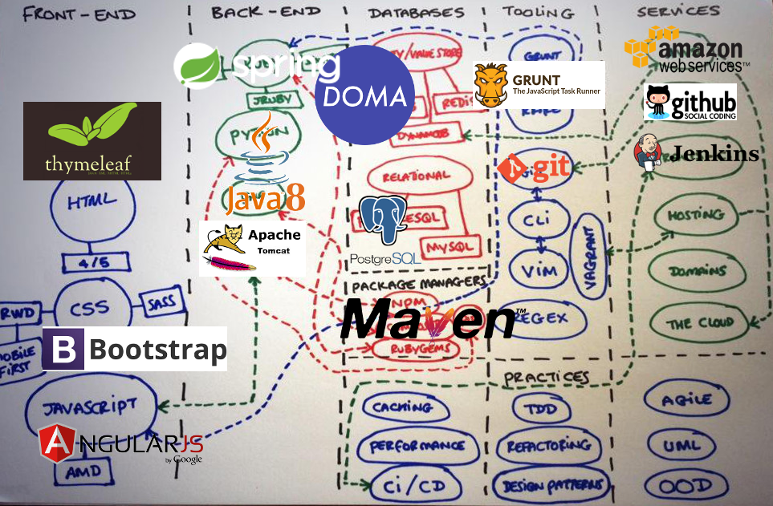
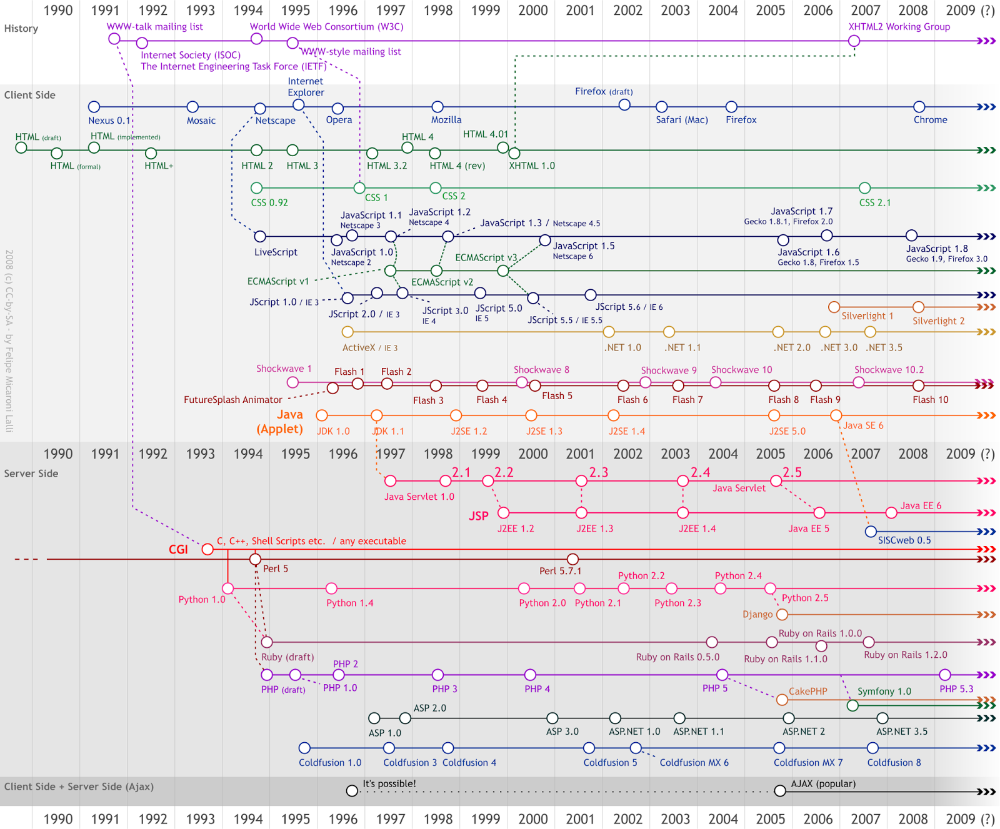

# Modern Java Web Application Development with Spring Boot

* スライド, https://k--kato.github.io/modernJWeb
* サンプル&問題, https://github.com/k--kato/marsweather

# 技術要素

## Web アプリケーション
* アーキテクチャの理解
 * Web API
 * REST
 * HTTP
* フロントエンド
 * Chrome 拡張機能
 * Chrome 開発者ツール
 * HTML
 * Javascript
 * CSS
 * thymeleaf
 * Cookie とセッション
* バックエンド
 * Web サーバ
    * Apache httpd
    * Apache Tomcat
 * Web アプリケーション フレームワーク
    * Spring Boot (Java)
    * Doma 2 (Java)

## データベース
* DBMS
 * PostgreSQL
 * pgAdmin III
* SQL
 * Create (Insert)
 * Read (Select)
 * Update
 * Delete
* リレーショナル演算
 * Join
 * Union
* トランザクション
 * Commit
 * Rollback
* テーブル以外のオブジェクトについて
 * View
 * Trigger
 * Function

## ソースコード管理
* Git
* GitHub
* Maven

## プログラミング
* Java 8
 * 平均の算出
 * 単純ソート（バブルソート）
* IDE
 * IntelliJ IDEA Community Edition

## Windows/Linuxの基本操作
* コマンドラインで Java がコンパイルできる
* コマンドラインで Git が操作できる

## ネットワーク
* 共有フォルダ
* プリンタ

## その他
* 正規表現
* エクセル数式（マクロより数式）

