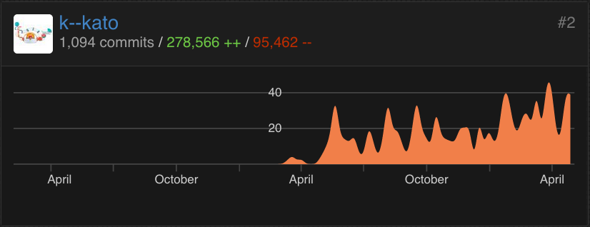

# Scala vs. Java 8

[](https://twitter.com/k_kato) 

[Scala福岡2016](http://scala.connpass.com/event/26674/)@[nulab](https://nulab-inc.com/)

2016 年 5 月 28 日[@k_kato](https://twitter.com/k_kato)


## Keisuke Kato @ [CAM](https://www.cam-net.co.jp)

<!-- .slide: data-background="rgb(0, 43, 54)" -->
```js
const profile = {timeline: [
    {year: 2010, lang: "Java", job: "SI" },
    {year: 2011, lang: "C#"  , job: "SI" },
    {year: 2012, lang: "C#"  , job: "SI" },
    {year: 2013, lang: "Java", job: "SI" },
    {year: 2014, lang: "C#"  , job: "SI" },
    {year: 2015, lang: "Java", job: "Web"}
]};
```
<!-- .element: class="fragment" data-fragment-index="1" -->
```js
const addTimeline2016 = (profile) => {
    profile.timeline.push({
        year: 2016,
        lang: "Scala",
        job: "Web",
        do: "『C# モダン Web 開発』執筆中",
        try: "Microsoft MVP"
    });
}
```
<!-- .element: class="fragment" data-fragment-index="2" -->


### 給料が高い技術
###### Stack Overflow 開発者調査

ランク | 技術（2016）      | 給料（米国）
-----|-------------------|-------
1    | **Scala**         | <span style="color:yellow">$125,000</span>
1    | Spark             | $125,000
3    | Cassandra         | $115,000
3    | F#                | $115,000
3    | Hadoop            | $115,000
<!-- .element: class="fragment" data-fragment-index="1" -->

ランク | 技術（2015）      | 給料（米国）
-----|-------------------|-------
9    | **Java**          | <span style="color:yellow">$89,054 (-29%)</span>
<!-- .element: class="fragment" data-fragment-index="2" -->


### Java エンジニアは思う

<a href="http://bokete.jp/boke/13204822"></a>
<!-- .element: class="fragment" data-fragment-index="1" -->


<blockquote class="twitter-tweet" data-lang="en"><p lang="ja" dir="ltr">プログラミング言語と年収に因果関係があると思ってる人はまず統計学の基本から学ぶべきなのでは</p>&mdash; Java Jungle Jerk (@kuenishi) <a href="https://twitter.com/kuenishi/status/732912084023812097">May 18, 2016</a></blockquote>


### 💰💰💰 Scala とは？ 💰💰💰

> 関数型プログラミングコミュニティでのオブジェクト指向プログラミングを見下したような態度にも，
<!-- .element: class="fragment" data-fragment-index="1" -->

>関数型プログラミングなど学者のお遊びで実用性がないとするオブジェクト指向プログラマの考えにも
<!-- .element: class="fragment" data-fragment-index="2" -->

>嫌気がさしていました - Dr. Odersky
<!-- .element: class="fragment" data-fragment-index="3" -->


## Scala => OOP + FP

* ハイブリッド
  * オブジェクト指向型プログラミング
<!-- .element: class="fragment" data-fragment-index="0" -->
    * カプセル化
<!-- .element: class="fragment" data-fragment-index="0" -->
    * ポリモーフィズム
<!-- .element: class="fragment" data-fragment-index="0" -->
    * 継承
<!-- .element: class="fragment" data-fragment-index="0" -->
    * 動的型付け
<!-- .element: class="fragment" data-fragment-index="0" -->
  * 関数型プログラミング
<!-- .element: class="fragment" data-fragment-index="1" -->
    * 型推論
<!-- .element: class="fragment" data-fragment-index="1" -->
    * 関数リテラル
<!-- .element: class="fragment" data-fragment-index="1" -->
    * 第一級関数
<!-- .element: class="fragment" data-fragment-index="1" -->
    * クロージャー
<!-- .element: class="fragment" data-fragment-index="1" -->


# ?
## 型推論
## 関数リテラル
## 第一級関数
## クロージャー


### 2015年 に Java 8 で 180 KLOC 書いた
### コーダーが Scala に入学してみた

 


## -> vs. =>
### Java 8
<!-- .element: class="fragment" data-fragment-index="0" -->
```scala
    Function<Double, Double> in2cm = (pizza) -> pizza * 2.54;
             ------  ------          ------     ------------
             引数型   戻り値型          引数        戻り値

```
<!-- .element: class="fragment" data-fragment-index="0" -->

### Scala
<!-- .element: class="fragment" data-fragment-index="1" -->
```scala
    val in2cm = (pizza: Double) => pizza * 2.54 
    ===         ------  ------     ------------
戻り値型を型推論    引数    引数型        戻り値

```
<!-- .element: class="fragment" data-fragment-index="1" -->


## ->

言語                     | ラムダ式 | I/F/O
------------------------|---------|-----------
Haskell                 | ->      | F 
Erlang                  | ->      | F 
F#                      | ->      | F/O 
C++11                   | ->      | F/O 
Julia                   | ->      | F/O 
Swift                   | ->      | F/O 
OCaml                   | ->      | I/F/O 
Perl 5                  | ->      | I/F/O 


## =>

言語                     | ラムダ式 | I/F/O
------------------------|---------|----------
D                       | =>      | F/O
Standard ML             | =>      | I/F
C#                      | =>      | I/F/O 
Dart                    | =>      | I/F/O 
Ruby                    | =>      | I/F/O 
Scala                   | =>      | I/F/O 
Javascript (ES6/ES2015) | =>      | I/F/O 


# =>


# <span style="writing-mode: tb-rl"><=</span>


### <span style="writing-mode: tb-rl"><=</span> 海外の伝統芸能


### <span style="writing-mode: tb-rl"><=</span> 日本の伝統芸能


## apply vs. ()

### Java 8
<!-- .element: class="fragment" data-fragment-index="0" -->
```scala
    Function<Double, Double> in2cm = (pizza) -> pizza * 2.54;
                             --------------------------------   
                             関数リテラル

    in2cm.apply(10.0);
          ===========
          👎 apply は冗長 (NG: 10, OK:10.0)
```
<!-- .element: class="fragment" data-fragment-index="0" -->

### Scala
<!-- .element: class="fragment" data-fragment-index="1" -->
```scala
    val in2cm = (pizza: Double) => pizza * 2.54
        ---------------------------------------
        関数リテラル

    in2cm(10)
         ====
         👍 apply は省略可 (OK: 10, OK:10.0)
```
<!-- .element: class="fragment" data-fragment-index="1" -->


### 非純粋クロージャー vs. 純粋クロージャー

### Java 8
<!-- .element: class="fragment" data-fragment-index="0" -->
```scala
{ // リテラル関数 in2cm 視点から見たエンクロージング・スコープ
    double in = 2.54;

    Function<Double, Double> in2cm = (pizza) -> {
        in = 2.5; // 👎 コンパイル エラー： 「事実上 final」として扱われる
        return pizza * in; // 👎 return は冗長
    };
}
```
<!-- .element: class="fragment" data-fragment-index="0" -->

### Scala
<!-- .element: class="fragment" data-fragment-index="1" -->
```scala
{
    var in = 2.54
    
    val in2cm = (pizza: Double) => {
      in = 2.5 // 👍 変更可能： 純粋なクロージャー
      pizza * in // 👍 return 省略可
    }
}
```
<!-- .element: class="fragment" data-fragment-index="1" -->


## 前方参照 エラー vs. 許容

### Java 8
<!-- .element: class="fragment" data-fragment-index="0" -->
```scala
{
    Supplier<Double> regularPizza = () -> in2cm.apply(10.0);
                                          =====
                                          👎 前方参照エラー
    Function<Double, Double> in2cm = (pizza) -> pizza * 2.54;
}
```
<!-- .element: class="fragment" data-fragment-index="0" -->

### Scala
<!-- .element: class="fragment" data-fragment-index="1" -->
```scala
{
    val regularPizza = () => in2cm(10) // 👍 前方参照 OK
    val in2cm = (pizza: Double) => pizza * 2.54

    val x = () => {
      val regularPizza = () => in2cm(10) // 👍 前方参照エラー
      val in2cm = (pizza: Double) => pizza * 2.54
    }
}
```
<!-- .element: class="fragment" data-fragment-index="1" -->


## イレイジャー vs. 具象化

### Java 8
<!-- .element: class="fragment" data-fragment-index="0" -->
```scala
    double pizza(Function<Integer, Double> in2cm);
    double pizza(Function<Double , Double> in2cm); // 👎 エラー
```
<!-- .element: class="fragment" data-fragment-index="0" -->

### Scala
<!-- .element: class="fragment" data-fragment-index="1" -->
```scala
    def pizza(in2cm: Function[Integer, Double]) : Double;
    def pizza(in2cm: Function[Double , Double]) : Double; // 👎 エラー
```
<!-- .element: class="fragment" data-fragment-index="1" -->

### C# #
<!-- .element: class="fragment" data-fragment-index="2" -->
```c#
    double pizza(Func<int   , double> in2cm);
    double pizza(Func<double, double> in2cm); // 👍 
```
<!-- .element: class="fragment" data-fragment-index="2" -->


## まとめ

* Scala はイケている
<!-- .element: class="fragment" data-fragment-index="1" -->
* Scala は給料が高い
<!-- .element: class="fragment" data-fragment-index="2" -->
* Scala => 💵
<!-- .element: class="fragment" data-fragment-index="3" -->
* 💵
<!-- .element: class="fragment" data-fragment-index="4" -->
* C# も頑張っている
<!-- .element: class="fragment" data-fragment-index="5" -->


# Thanks


## References

1. Stack Overflow, [Stack Overflow Developer Survey Results 2016](https://stackoverflow.com/research/developer-survey-2016)
1. Stack Overflow, [Stack Overflow Developer Survey Results 2015](https://stackoverflow.com/research/developer-survey-2015)
1. Wikipedia, [Anonymous function](https://en.wikipedia.org/wiki/Anonymous_function)
1. Wikipedia, [オブジェクト指向プログラミング]( https://ja.wikipedia.org/wiki/%E3%82%AA%E3%83%96%E3%82%B8%E3%82%A7%E3%82%AF%E3%83%88%E6%8C%87%E5%90%91%E3%83%97%E3%83%AD%E3%82%B0%E3%83%A9%E3%83%9F%E3%83%B3%E3%82%B0)
1. Twitter, [Scala School](http://twitter.github.io/scala_school/)
1. Ted Neward, [Java 8：ラムダ式、パート1](http://www.oracle.com/technetwork/jp/articles/java/architect-lambdas-part1-2080972-ja.html)
1. Brian Goetz, [言語設計者のノート: 新機能と、それに付随する新機能](https://www.ibm.com/developerworks/jp/java/library/j-ldn3/)